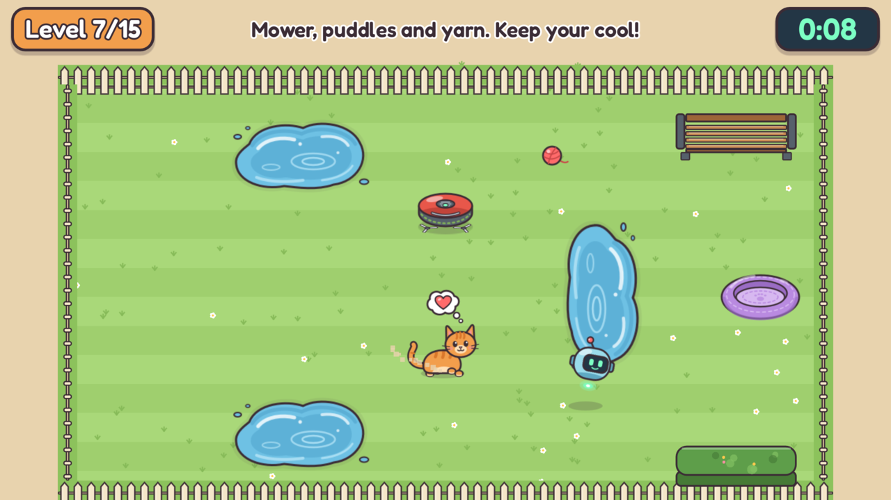

# Silly Kitty

**You only move the robot. Kitty decides the rest.**



A little puzzle game made for [Jamference: AI Game Jam Hack 1](https://itch.io/jam/jamference-ai-game-jam-hack-1) (theme "Cat and Robot", restriction "Movement Input Only").

**Play it in your browser: https://linostar.itch.io/sillykitty**

You steer a hovering robot that kitty finds endlessly interesting. Lure kitty home to its bed across 15 garden levels before the timer runs out, while it follows you, plays with yarn, runs from the robot lawnmower, the dog and the sprinklers, refuses to touch water, and dozes off if you leave it alone. Finish fast for up to 3 stars per level.

## Controls

Arrow keys, WASD, or a gamepad's d-pad or left stick move the robot. That is the only input: the menus are rooms you fly through, and retries and level changes happen by themselves.

## How it was made

Made by **linostar** (direction, design, playtesting) with **Claude** (Anthropic), used through Claude Code, which wrote all of it:

- **Code:** the GDScript for Godot 4.7.1.
- **Art:** the SVG sprites and the code-drawn garden.
- **Audio:** the Python synthesisers behind every sound effect and both music loops.
- **Levels:** the 15 layouts and their scripted test routes.

The cat is a utility-scoring game AI (chase, play, flee, nap, go to bed) with line of sight. No language model runs inside the game. The full write-up is in [SUBMISSION.md](SUBMISSION.md).

## Running it locally

1. Install [Godot 4.7.1](https://godotengine.org/download) (standard build).
2. Open `sillykitty/project.godot` in Godot and press Play (F5).

## Development

The tools live outside the Godot project, in `tools/`. Run these from the repo root on macOS; set `GODOT` to point at your Godot binary on other systems.

```sh
tools/validate.sh      # import, restriction checker, 109 headless gameplay checks, headless run
tools/build_web.sh     # validate + web export + Playwright smoke and resume tests + itch zip
python3 tools/sfx.py   # regenerate every sound effect (standard library only)
python3 tools/music.py # regenerate both music loops (needs lame and ffmpeg)
```

The browser tests need a one-time `PLAYWRIGHT_SKIP_BROWSER_DOWNLOAD=1 npm --prefix tools ci` (they use the installed Google Chrome).

| Path | What |
|---|---|
| `sillykitty/` | Godot project: `scenes/`, `scripts/`, `art/` (SVG), `audio/`, `fonts/`, `data/` |
| `tools/` | tests, restriction checker, sound and music synthesisers, web build and browser tests |
| `submission/` | itch.io cover and screenshots |

## Credits

- Font: [Fredoka](https://github.com/hafontia/Fredoka-One) by the Fredoka Project Authors, SIL Open Font License 1.1 (`sillykitty/fonts/OFL.txt`).
- Engine: [Godot Engine](https://godotengine.org) (MIT license).
